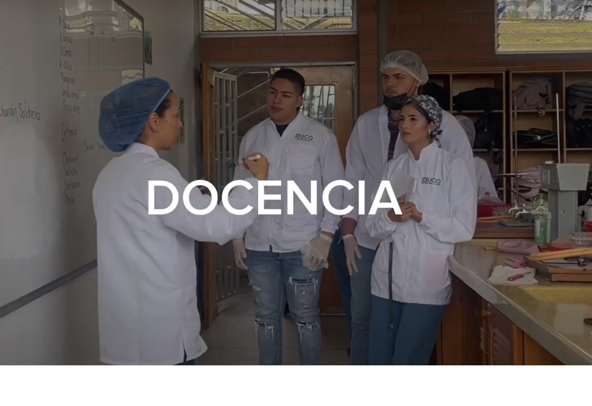

author: Juan Camilo Acevedo
summary: Plantilla Markdown
id: template_codelab
categories: codelab
environments: Web
status: Published
feedback link: https://github.com/juanacevedo3148

# Título Codelab

## Cabecera

#### Complete los metadatos del encabezado

Copie y pegue los encabezados a continuación en su archivo de rebajas y cambie los valores apropiadamente. 

Las pautas están disponibles debajo de los encabezados de muestra.

``` bash
author: Author Name
summary: Summary of your codelab that is human readable
id: unique-codelab-identifier
categories: codelab,markdown
environments: Web
status: Published
feedback link: A link where users can go to provide feedback (Maybe the git repo)
analytics account: Google Analytics ID
``` 


Los metadatos constan de pares clave-valor de la forma "clave: valor". Las llaves no pueden

contener dos puntos y los campos de metadatos separados deben estar separados por líneas en blanco.

En la actualidad, todos los valores deben estar en una línea. Todos los metadatos deben ir antes del

título. Se pueden utilizar claves y valores arbitrarios; sin embargo, sólo lo siguiente

será entendido por el renderizador:

* Resumen: un resumen legible por humanos del codelab. El valor predeterminado está en blanco.

* Id: Un identificador compuesto por letras minúsculas que idealmente describe el

  Contenido del codelab. Este campo debe ser único entre

  laboratorios de código.

* Categorías: una lista separada por comas de los temas que cubre el codelab.

* Entornos: una lista de entornos en los que se debería poder descubrir el codelab.

  Los Codelabs marcados como "Web" serán visibles en el índice de Codelabs. Codelabs marcados

  "Kiosco" solo estará disponible en los quioscos de Codelabs, que tienen características especiales.

  equipo adjunto.

* Estado: El estado de publicación del codelab. Los valores válidos son:

  - Borrador: Codelab no está terminado.
  - Publicado: Codelab está terminado y visible.
  - En desuso: Codelab se considera obsoleto y no debe publicitarse ampliamente.
  - Oculto: Codelab no se muestra en el índice.

* Enlace de comentarios: un enlace al que enviar a los usuarios si desean dejar comentarios sobre el

  laboratorio de código.

* Cuenta de Analytics: un ID de Google Analytics para incluir en todas las páginas de codelab.

## Título sección 01
Duration: 0:02:00

Lorem ipsum dolor sit amet, consectetur adipiscing elit. Ut mattis elit nisl, in tincidunt ex blandit a. Phasellus eros nisi, consequat lobortis diam at, consequat semper felis. Duis accumsan fermentum velit, sit amet tempus quam imperdiet id. Vivamus justo arcu, ullamcorper eu lobortis sit amet, posuere id ligula. Vestibulum dapibus, odio ut ornare luctus, lacus odio ornare nisl, quis lobortis sem tellus a purus. Vestibulum dapibus eu lorem in lacinia. Aliquam scelerisque ut eros ac faucibus. Sed vulputate, magna finibus laoreet mollis, turpis ligula iaculis nunc, a laoreet nunc ex ac odio. Phasellus bibendum, massa sed iaculis laoreet, augue nunc sagittis dolor, a ultricies augue est quis eros. Nam id tortor nibh. Cras eget ex aliquet, rhoncus enim egestas, lobortis mi. Suspendisse eu varius nisi. Aliquam sed ante ut quam ultricies ullamcorper sit amet id sapien. Vestibulum nec euismod ligula

Enumaraciones

1. Numeral 1
2. Numeral 2
3. Numeral 3

Lorem ipsum dolor sit amet, consectetur adipiscing elit. Ut mattis elit nisl, in tincidunt ex blandit a. Phasellus eros nisi, consequat lobortis diam at, consequat semper felis. Duis accumsan fermentum velit, sit amet tempus quam imperdiet id. Vivamus justo arcu, ullamcorper eu lobortis sit amet, posuere id ligula. Vestibulum dapibus, odio ut ornare luctus, lacus odio ornare nisl, quis lobortis sem tellus a purus. Vestibulum dapibus eu lorem in lacinia. Aliquam scelerisque ut eros ac faucibus.

### Sutítulo de sección

Lorem ipsum dolor sit amet, consectetur adipiscing elit. Ut mattis elit nisl, in tincidunt ex blandit a. Phasellus eros nisi, consequat lobortis diam at, consequat semper felis. Duis accumsan fermentum velit, sit amet tempus quam imperdiet id. Vivamus justo arcu, ullamcorper eu lobortis sit amet, posuere id ligula. Vestibulum dapibus, odio ut ornare luctus, lacus odio ornare nisl, quis lobortis sem tellus a purus. Vestibulum dapibus eu lorem in lacinia. Aliquam scelerisque ut eros ac faucibus.


## Título sección 02
Duration: 0:04:00

Lorem ipsum dolor sit amet, consectetur adipiscing elit. Ut mattis elit nisl, in tincidunt ex blandit a. Phasellus eros nisi, consequat lobortis diam at, consequat semper felis. Duis accumsan fermentum velit, sit amet tempus quam imperdiet id.

**Recursos:**
* Descargar visual studio code: [Visual Studio Code](https://code.visualstudio.com/)
* Editor markdown en linea [Editor Markdown](https://editormarkdown.com/)
* [Universidad Catolica de Oriente](https://www.uco.edu.co) - Universidad Catolica de Oriente


## Multimedia
Duration: 0:05:00

### Imagenes

Para cargar una imagen se hace de la siguiente forma

#### Opcion 1


#### Opcion 2

<image src="bird.jpg" alt="Pajaro2">

### Videos

Se puede insertar videos de youtube en un tutorial, para ello tendrá que realizar las siguientes acciones:

1. Cree una imagen donde irá el video. Puede ser un pantallazo del mismo.
2. Agregue un texto alternativo a la imagen
3. En el campo de descripción del texto alternativo, pegue el enlace del video que quiere utilizar. El enlace debe tener el formato: https://www.youtube.com/watch?v=video_ID

[](https://www.youtube.com/watch?v=V4yZ5XZNbnA)


## Código
Duration: 0:05:00

Para insertar código se utiliza las comillas

#### Una sola línea de código


``` Python
# Esto es un comentario

print("Hola Mundo")
```

#### Varias líneas de código 


``` Python
# Esto es otro comentario

a = int(input("Ingrese el valor de a "))
b = int(input("Ingrese el valor de b "))
c = a*b
print("El resultado es ", c)
```

## Botones
Duration: 0:02:00

Para la creacion de un boton se utiliza la opcion button

Ejemplo: Un boton de accion para descargar visual studio code

<button>[Visual Studio Code](https://code.visualstudio.com/Download)</button>

## Comandos utiles

Ahora que tiene un codelab inicial definido en su archivo markdown, se puede generar el contenido estático del sitio. 

Se puede exportar y servir el contenido localmente usando el comando `claat` que instalamos anteriormente.

``` bash
$ claat export codelab.md
$ claat serve
```

* Su navegador debería haberse abierto (si no lo hace, intente ir a localhost:9090 en su navegador). 

* Elige el directorio que coincida con tu "id" que pusiste en los encabezados. 

* ¡Listo! ¡Deberías tener tu primer codelab!


Cuando se ejecuta el comando `claat export`, se crea el contenido web estático necesario para alojar el codelab. 

El contenido web estático se crea en un directorio especificado por su "id" único y se puede ver localmente abriendo la página index.html.

## Mayor informacion
Duration: 0:01:00


- Google Codelab en 5 minutos [Codelab](https://medium.com/shokmaster/google-codelab-en-5-minutos-5043f4cd21f4)

- Web Oficial [CodeLabs Site](https://github.com/googlecodelabs/tools/blob/master/site/README.md)

- ¿Cómo crear un Codelab? [¿Cómo crear un Codelab?] https://docs.crip.conacyt.mx/codelabs/how-to-write-a-codelab/index.html?index=..%2F..index
